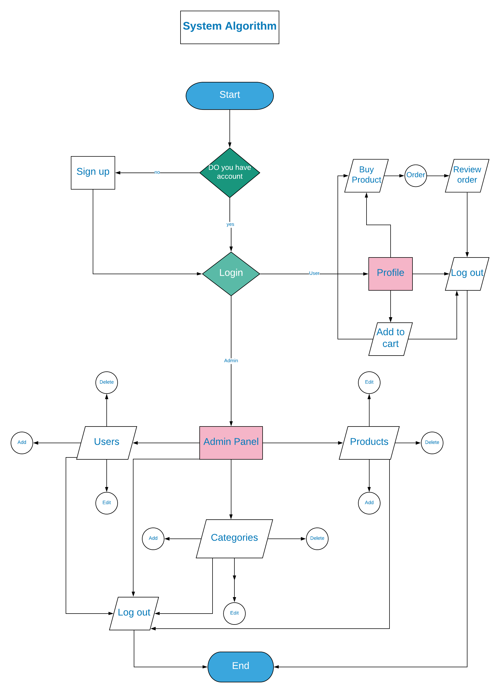

# Small Ecommerce 

## About the project

the project is a very basic ecommerce have built with larvel and vue js 

## What tools hav used in the project  ?

### Front end 

html5 / sass / bootstrap /    
/ in vue js  
      "@fortawesome/fontawesome-free": "^5.13.0",   
        "admin-lte": "^3.0",    
        "laravel-vue-pagination": "^2.3.1",   
        "moment": "^2.26.0",   
        "sweetalert2": "^9.14.0",   
        "vform": "^1.0.1",   
        "vue-progressbar": "^0.7.5",   
        "vue-router": "^3.3.2",   
        "vue-star-rating": "^1.6.1"   

### Back end 
larvel and passport and jwt auth 

## Alogrithm this app 

this design will make you understand the site work 

## Database erd design

this design will make you understand how the database built 

## Config 

 1-first go to .env file and edit the name datbase and user and password  
2-second run php artisan migrate  
3-third run php artisan serve  
4-fourth go to http://127.0.0.1:8000/register and create your  account  
5-go to your database an open the users table and edit type from user to admin   
5-now you can login in the admin panel and add and delete the products and categories and users   
6-enjoy 
 
   
